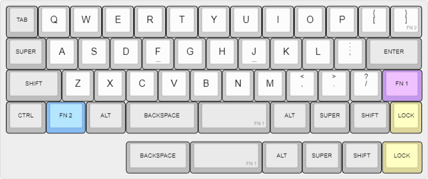
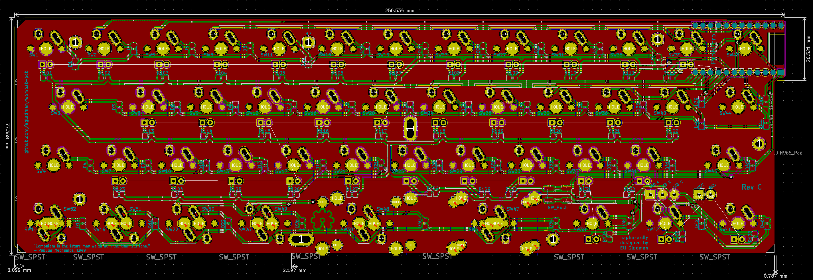

# The Wombat PCB

The Wombat is my personal 40% keyboard that I've slowly refined over the years.

### Project Goals

- Standard staggered row. I see so many mis-aligned 40% keyboards, I have no clue how people can effectively type on them.
- No `2.75u` keys. I find `2.75u` keycaps to wobble too much for everyday typing (even with geniune GMK stabs), therefore the longest key on the Wombat is `2.25u`.
- Dedicated bracket keys (i.e. `[`, `]`). I'm a software engineer and I find these keys invaluable.
- HHKB style arrow keys. I've become super fond of this layout ever since owning my first HHKB.
- Non-fullsize space bar. I find a standard `6.25u` (or god forbid anything larger) to be a waste of space. A little part of me dies each time I see a `7u` spacebar on a 40%.
- Case friendly design. By extending the header pins from the board we're able to make the female usb port flush with cases. 
- Side removable cable. I typicallly use my 40% boards when I'm using my laptop. By having the usb cable connect on the left, I'm able to push the keyboard up against my laptop saving valuable space. Sorry left handers :frowning:
- MX/Alps compatibility. It's so easy to support Alps, why not...
- Pro Micro compatability. They're cheap and ubiquitous; headers are infintely easier to solder than SMT for a novice.
- Backspace inline with spacebar. I prototyped multiple layouts before ultimately deciding on this. That was three years ago and I've been using this layout ever since.
- TMK/QMK compatibility.
- LED backlighting. Only the Alphas are backlight, this is a comprise to retain support for multiple bottom rows.
- Low profile design. Keyboards built with Pro Micros tend to be thick. By mounting the controller upside we're able to save valuable space. Sure I could forgo the Pro Micro entirely, and solder the chip directly to the board, but I'm lazy.
- Proton-C and Elite-C compatibility. Due to how we mount the microcontroller upside down, this wasn't supported in Rev A. (Rev A source code has since been lost. RIP)

### Drawbacks

- Keycap compatibility. Good lucking finding properly labeled modifiers. This isn't a deal breaker for me since I mostly type on blanks these days.
- I'm sure there are other drawbacks, I think I've just become blind to them. I've been using this layout for 3+ years without problems.

### Changes

#### Rev C

- Multiple bottom rows now supported.
- Backlighting (Alphas only)
- Additional pinouts (three LEDs) are broken out for the Proton-C and Elite-C. The Pro Micro can't utilize these pins since we're maxing out the pins. These LEDs are intended to be used as layer indicators.

#### Rev B

- Backlighting
- Pro Micro low profile mount. Every `0.1mm` counts.

### Layout

### PCB

### Firmware

[TMK](https://github.com/egladman/wombat-tmk). The fork is super old, so I still need to pull in the latest changes.

### License

[CERN Open Hardware Licence v1.2 ](https://github.com/egladman/wombat-pcb/blob/revc/LICENSE)
