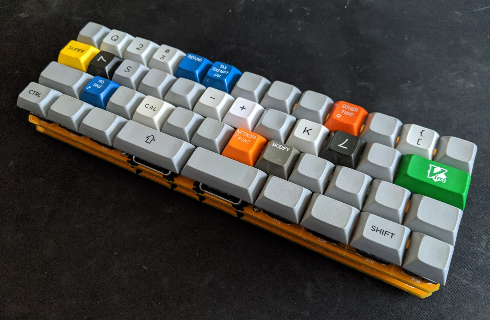
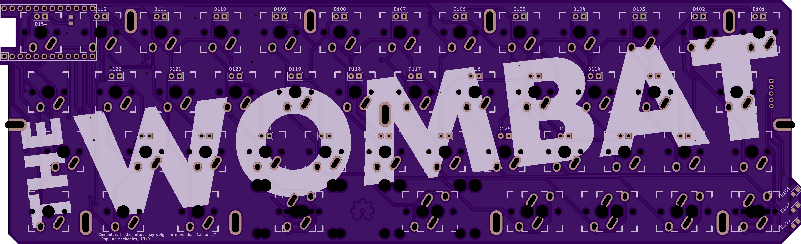
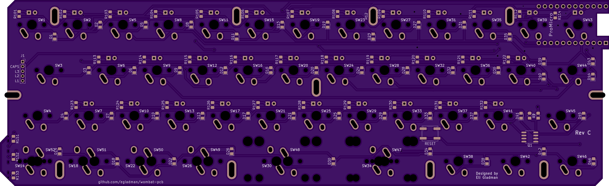
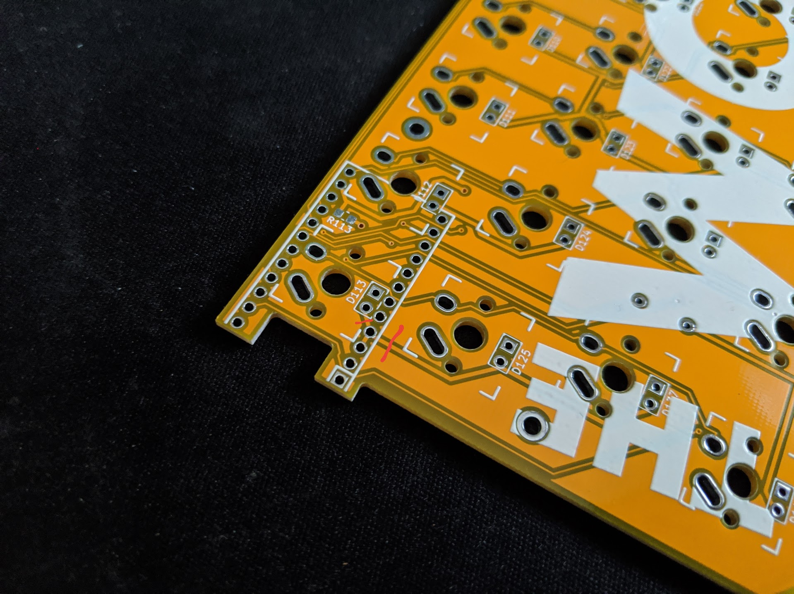

# The Wombat

The Wombat is my 40% daily driver that I've been using for 3+ years.

![RevC Back - Kicad(img/revc/wombat_pcb_back.png)

### Project Goals
- Open source design. It was important that I use an open source EDA too.
- Standard staggered row. I see so many mis-aligned 40% keyboards, I have no clue how people can effectively type on them.
- No `2.75u` keys. I find `2.75u` keycaps to wobble too much for everyday typing (even with geniune GMK stabs), therefore the longest key on the Wombat is `2.25u`.
- Dedicated bracket keys (i.e. `[`, `]`). I'm a software engineer and I find these keys invaluable.
- HHKB style arrow keys. I've become super fond of this layout ever since owning my first HHKB.
- Non-fullsize space bar. I find a standard `6.25u` (or god forbid anything larger) to be a waste of space. A little part of me dies each time I see a `7u` spacebar on a 40%.
- Case friendly design. By extending the header pins from the board we're able to make the female usb port flush with cases. 
- Side removable cable. I typicallly use my 40% boards when I'm using my laptop. By having the usb cable connect on the left, I'm able to push the keyboard up against my laptop saving valuable space. Sorry left handers :frowning:
- MX/Alps compatibility. It's so easy to support Alps, why not...
- Pro Micro compatability. They're cheap and ubiquitous; headers are infintely easier to solder than SMT for a novice.
- Backspace inline with spacebar. I prototyped multiple layouts before ultimately deciding on this. That was three years ago and I've been using this layout ever since.
- TMK/QMK compatibility.
- LED backlighting. Only the Alphas are backlight, this is a comprise to retain support for multiple bottom rows.
- Low profile design. Keyboards built with Pro Micros tend to be thick. By mounting the controller upside we're able to reduce the required clearance to `6mm`.
- Proton-C and Elite-C compatibility. Due to how we mount the microcontroller upside down, this wasn't supported in Rev A. (Rev A source code has since been lost. RIP)

### Drawbacks

- Lack of keycap compatibility. Good luck finding properly labeled modifiers. This isn't a deal breaker for me since I mostly type on DSA blanks.
  - The bottom row variant introduced in Rev C partially helps mitigate this issue.
- The right shift has been relocated to the bottom row. I prioritized the placement of `FN1` (think HHKB).
- I'm sure there are other drawbacks, I think I've just become blind to them. I've been using this layout for 3+ years without problems.

### Changes

#### Rev C

- Multiple bottom rows now supported.
- Backlighting Support (Alphas only)
- Additional pinouts (three LEDs) are broken out for the Proton-C and Elite-C. The Pro Micro can't utilize these pins since we're maxing out the pins. These LEDs are intended to be used as layer indicators.

#### Rev B

- Backlighting Support
- Pro Micro low profile mount. Every `0.1mm` counts.

### Known Issues

#### Rev B

- The LED through holes on top row are slightly misaligned. Be patient when inserting the anode.
- Incorrect footprint for `D1`. It's solderable, but tricky.
- **IMPORTANT:** Ground for backlighting is misrouted. Backlighting/Keyboard is inoperable until ground trace is severed. See red lines.

### Layout

### PCB

*Ignore the dirty residual flux, these pictures were taken mid-build before the boards were cleaned.*

### Components

- 35 `SMD 0805` 300ohms Resistors. [example](https://www.mouser.com/ProductDetail/panasonic/erj-6enf3000v/?qs=50QC8w71jAu7HdivK4y78A%3D%3D&countrycode=US&currencycode=USD)
- 46 `SOD-123` 1N4148 Diodes. [example](https://www.mouser.com/ProductDetail/diodes-incorporated/1n4148w-7-f/?qs=LHX0FizJzg7Ae9ZM8LTAWw%3D%3D&countrycode=US&currencycode=USD)
- 1 Microcontroller
  - Pro Micro [example](https://www.sparkfun.com/products/12640)
  - Proton-C [example](https://olkb.com/parts/qmk-proton-c)
  - Elite-C [example](https://keeb.io/products/elite-c-usb-c-pro-micro-replacement-arduino-compatible-atmega32u4?variant=31151566389342) *I personally haven't tested compatibility, but it should work*
- Header pins `PTH, 0.1`
- SMD Momentary NO Switch (Reset Button) *I need to look up the part number I used.*

If you choose to make a back from an extra pcb you'll need:
- 8 M2x6mm female to female threaded spacers
- 16 M2x4mm screws
- Blue loctite or M2 lock washers doesn't hurt...

### Firmware

- [QMK](https://github.com/egladman/qmk_firmware/tree/wombat-support/keyboards/wombat).
- [TMK](https://github.com/egladman/wombat-tmk). My TMK fork is super old, and is only here for archival purposes. Use QMK.

### License

[CERN Open Hardware Licence v1.2 ](https://github.com/egladman/wombat-pcb/blob/revc/LICENSE)
